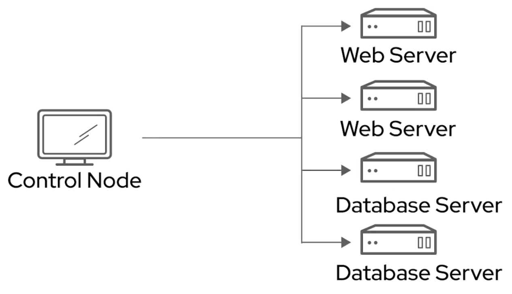

# Creating a Static Inventory of Managed
Hosts


`ansible --version` - check all env variables 
Any host can belong to as many groups as necessary
Define large system ranges
Numeric and alphabetical expansion 
You need only supply overriding values when you wish to change from these default settings. 

Default: 
`/etc/ansible/hosts`
`/etc/ansible/ansible.cfg`

Any inventory file can be suplied:
```
[webservers]
web01
web02
[databases]
db01
db02
```

`ansible-inventory -i inventory_file  --list`
This should iterate through all of the hosts we've listed in our inventory and give us a JSON‑formatted output for those contained within.

```
{
    "_meta": {
        "hostvars": {}
    },
    "all": {
        "children": [
            "databases",
            "ungrouped",
            "webservers"
        ]
    },
    "databases": {
        "hosts": [
            "db01",
            "db02"
        ]
    },
    "webservers": {
        "hosts": [
            "web01",
            "web02"
        ]
    }
}
```
# Managing Connection Settings and Privilege Escalation

`ansible-config dump` - show all configuration
`ansible-config dump --only-changed` - only changed 

```
/root/ansible/ansible.cfg
[defaults]
inventory = /root/ansible/inventory

[privilege_escalation]
become=True
become_method=sudo
become_user=root
become_ask_pass=False
```

```
cd /root/ansible/  
`ansible --version`
```

```
/root/ansible/db01
#  Host variables for the db01
---
become_ask_pass: True
```

`ansible all -i inventory -m ping` - ping all hosts

 ```
ansible databases --limit db01 -m ping
db01 | SUCCESS => {
    "ansible_facts": {
        "discovered_interpreter_python": "/usr/libexec/platform-python"
    },
    "changed": false,
    "ping": "pong"
}
```

# Running a One-Off Task with Ad Hoc Commands
Ad hoc commands are simple, one line operations that are run without writing a playbook.
.The ping module doesn't actually send an ICMP packet like we're used to as system administrators using the ping command, but it does check to see if Ansible can contact the managed host


 `ansible-doc -l`  - lists all availible modules 
 `ansible-doc -l | grep ping`
 `ansible-doc ping` - information on how to use a module
 OPTIONS (`=` is mandatory, `-` optional)
 
 `ansible all -i inventory -m ping` - ping all hosts
 `ansible all --limit web01 -i invernotry -k -m ping` 
 `ansible web01 -m service -a "state=restarted name=sshd"`
 
 # Selected Ansible Modules
 "Asnible Module Index" Search in google, and select cathegory 
 https://docs.ansible.com/ansible/2.9/modules/modules_by_category.html
 
 YELLOW - Changed
 GREEN - Success
 
 `package` module is systme agnostic
 `yum`, `apt`,  `dnf` - system specific