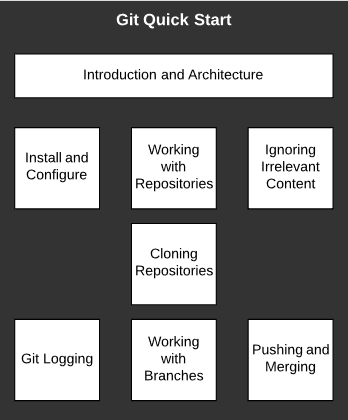
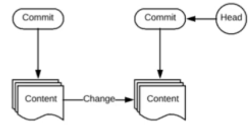
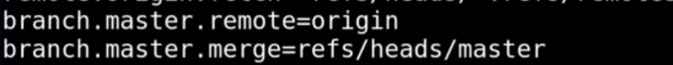

# Git Introduction and Architecture
• The `git` program is a source control tool created by Linus Torvalds.
• Simply stated, `git` manages content snapshots, checksums, and metadata to keep track of changes in files.
• Some basic terminology (we will go into more detail as we work through!):
– Each state is known as a commit.
– The current commit is called the head.
– Commits are affiliated with repositories and branches.
– The head may be moved between commits.

Simply: Keep track of changed, who is making changes and when.

# Installation and Configuration
• To install Git:
 `sudo yum install git` or `sudo apt-get install git`
• Git configuration may be managed using git config:
 `git config --global user.name <username>`
 `git config --global user.email <email_addr>`
 `git config --system core.editor vim`
 `git config --global core.editor "'C:\Program...\...\code.exe' -w"` - Windows: `-w`, `--wait` is to wait for window to be closed before returning.
• Alternatively, you may store system-wide configuration values in the file directly:
 `/etc/gitconfig` which corresponds to `--system`
 `~/.gitconfig` or `~/.config/git/config` which corresponds to `--global`
 `.git/config` in a repository which corresponds to `--local`
Note: Files lower in the list override files higher in the list.
`git config -l` - prints current configuration
File Example:
```
[user]
name = john smith
email = john@example.com
```


# Creating a Repository and Adding Content
• Use `git init <repo-directory>` to create or “initialize” a new repository in the specified directory.
– The init subcommand will create a `.git` directory in the repository used for Git metadata
(see Git Deep Dive course for more information).
• `git add <filename>` may be used to indicate relevant files for tracking in the repository.
• Tracking information on files within the directory may be obtained using `git status`.
• Once all relevant changes have been noted, run `git commit -m "text describing changes"` to commit the changes to the repository.
• If a file no longer requires tracking, the command `git rm <file>` may be used to stop tracking a provided file.

 `git add .` -  Add to commit everything 

 `git status` - It tells us about untracked files

 `git commit -m "some text"`
 `git commit -a -m "commit all changes"`

`git checkout file` - to bring file from the dead

 ```
$ git log
commit 4985af47a2fd0f65774fa09536a8c21e92e56b82 (HEAD -> master)
Author: Vitali Aukhimovich <700grm@gmail.com>
Date:   Tue Mar 8 14:28:01 2022 +0000

    Updated intro.txt and added another file

commit 88c926f2e28209abd98a094d9f5e859f61d60791
Author: Vitali Aukhimovich <700grm@gmail.com>
Date:   Tue Mar 8 14:20:54 2022 +0000

    first commit, added intro fiel
```


# Ignoring Irrelevant Content 
Compilers are creating object file, that are built into aplication. They are not source code or executables, they are in between. 
To ignore create file
```
vim .gitignore
*.jpg
/temp_folder
```

# Cloning Repositories
Tracking of two different sets of files 
Cloning over https


# Logs

Samples:
```
$ git log --oneline
9594508c7 (HEAD -> dev, origin/dev, origin/HEAD) Doc: Updated Markdown files
de7d3b6b8 Doc: Update for GSoC 2022
f5b6398d0 Doc: Add GSoC 2O22 annoucement
62a5cf520 Doc: Updated Markdown files
90bfffed0 Doc: Add GSoC 2O22 annoucement
a5b0d594c Doc: Updated GSoC 2022 mentors
1547256af Doc: Update GSoC 2022 themes
c3e7fcb47 Mobile: Fix: the camera button r
```

```
$ git log -p
commit 540821415de33c09c141a2420a4c7b28bd6d37cf (HEAD -> master)
Author: Vitali Aukhimovich <700grm@gmail.com>
Date:   Tue Mar 8 14:30:11 2022 +0000

    removed anotherfile

diff --git a/anotherfil b/anotherfil
deleted file mode 100644
index e69de29..0000000

commit 4985af47a2fd0f65774fa09536a8c21e92e56b82
Author: Vitali Aukhimovich <700grm@gmail.com>
Date:   Tue Mar 8 14:28:01 2022 +0000

    Updated intro.txt and added another file

diff --git a/anotherfil b/anotherfil
new file mode 100644
index 0000000..e69de29
diff --git a/intro.txt b/intro.txt
index 0841560..de9bfb4 100644
--- a/intro.txt
+++ b/intro.txt
@@ -1 +1,3 @@
 Hello it is a test file
+
+Added another line

commit 88c926f2e28209abd98a094d9f5e859f61d60791
```


# Working with branches
We can create branches of branches,
similar to clone just in the same repository


# Pushing and Merging

`git config -l`
